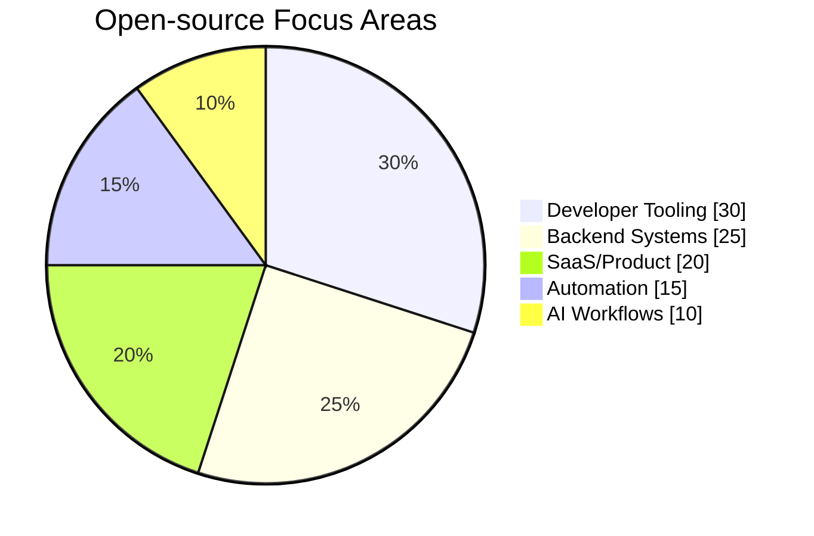

# Rasel Rana Rocky

> Building production-grade software across backend systems, developer tooling, and SaaS infrastructure.

## ✅ Quick Compatibility (HR-friendly)

| Category | Details |
|---|---|
| **Role fit** | Senior Software Engineer · Backend Engineer · Full-stack Engineer |
| **Primary stack** | **TypeScript · PHP · Go** |
| **Experience** | ~12 years in web technologies, including 4 years at Toptal |
| **Strengths** | System architecture, microservices, performance optimization, CI/CD, cloud infrastructure |
| **Leadership** | Led small engineering teams across remote/on-site engagements |
| **Location** | Dhaka, Bangladesh |

---

## 🧠 Tech & Capability Map

### Core Engineering
- Languages: TypeScript, JavaScript, PHP, Go, Python, Java, C#, C++, Rust
- Backend/API: Laravel, Symfony, Django, FastAPI, Flask, Go (Gin, Chi)
- Frontend: React, Vue, Angular, Svelte
- Infra/Data: AWS, Cloudflare, DigitalOcean, Docker, Kubernetes, Terraform, PostgreSQL, MySQL, MongoDB, Redis

### AI / ML / GenAI (Current Workflow)
- LLM + inference tools: **Ollama, LM Studio, OpenRouter, OpenAI, Anthropic, Cloudflare AI**
- Local model runtimes: **llama.cpp, stable-diffusion.cpp, whisper.cpp**
- Agentic/dev tools: **Codex, Claude Code**
- Computer vision practice: **training and using YOLO + LoRA-based vision workflows**
- Creative pipelines: **ComfyUI**

---

## 📦 Open-source Projects (Highlights)

### Core repositories
- [country-list-js](https://github.com/i-rocky/country-list-js) — country metadata package for JS/Node.js.
- [eloquent-dynamic-relation](https://github.com/i-rocky/eloquent-dynamic-relation) — dynamic relation support for Eloquent models.
- [laravel-twilio](https://github.com/i-rocky/laravel-twilio) — Twilio integration package for Laravel.
- [rofrof](https://github.com/thrivedesk/rofrof) — Pusher-compatible WebSocket server.

### Distribution channels for released tooling
- [homebrew-tap](https://github.com/i-rocky/homebrew-tap) — Homebrew formulae used to publish/install CLI tooling.
- [scoop-bucket](https://github.com/i-rocky/scoop-bucket) — Scoop manifests used to distribute tooling on Windows.

> Package-level formulas/manifests are maintained in those distribution repositories for installable releases.

---

## 📈 GitHub Profile Activity

```mermaid
xychart-beta
    title "Engineering Focus (Current)"
    x-axis [Backend, Platform, DevTools, AI/ML, OSS]
    y-axis "Intensity" 0 --> 10
    bar [10, 9, 8, 8, 8]
```



---

## 🤝 Connect

- GitHub: [@i-rocky](https://github.com/i-rocky)
- LinkedIn: [linkedin.com/in/i-rocky](https://www.linkedin.com/in/i-rocky)
- Toptal: [Rasel Rana Rocky](https://www.toptal.com/resume/rasel-rana-rocky)
- Email: `smrockypk@gmail.com`
