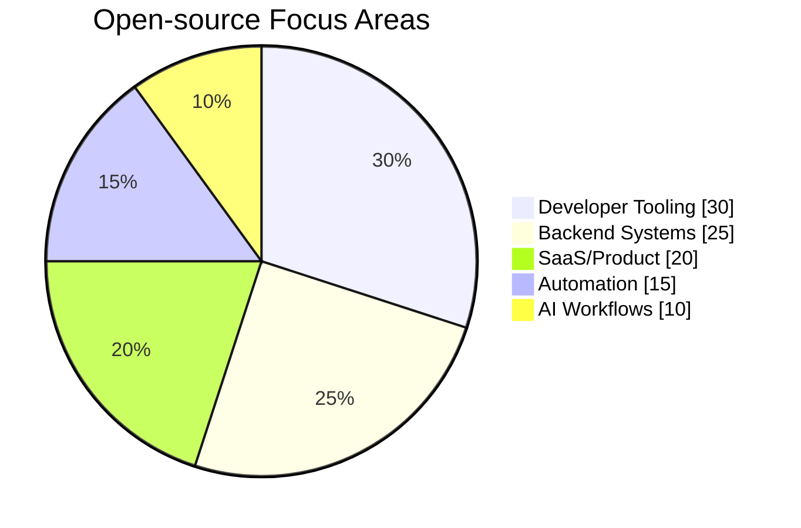

<div align="center">

# Rasel Rana Rocky

**Software Developer · SaaS Architect · Open Source Builder**


[](https://github.com/i-rocky)
[](https://www.linkedin.com/in/i-rocky)
[](https://www.toptal.com/resume/rasel-rana-rocky)
[](mailto:smrockypk@gmail.com)

</div>

---

## ✅ Quick Compatibility (HR-friendly)

- **Role fit:** Senior Software Engineer · Backend Engineer · Full-stack Engineer
- **Primary stack:** **TypeScript · PHP · Go**
- **Strengths:** System architecture, microservices, performance optimization, CI/CD, cloud infrastructure
- **Leadership:** Led small engineering teams across remote/on-site engagements

---

## 🧠 Tech & Capability Map

### Core Engineering

**Languages**


**Backend / API / Frontend**


**Infrastructure & Data**


### AI / ML / GenAI Workflow


-7C2D12?style=flat-square)


---

## 📦 Open-source Projects

- [country-list-js](https://github.com/i-rocky/country-list-js) — country metadata package for JS/Node.js
- [eloquent-dynamic-relation](https://github.com/i-rocky/eloquent-dynamic-relation) — dynamic relation support for Eloquent models
- [laravel-twilio](https://github.com/i-rocky/laravel-twilio) — Twilio integration package for Laravel
- [rofrof](https://github.com/thrivedesk/rofrof) — Pusher-compatible WebSocket server

### Distribution repos for released tooling

- [homebrew-tap](https://github.com/i-rocky/homebrew-tap)
- [scoop-bucket](https://github.com/i-rocky/scoop-bucket)

---

## 📈 GitHub Profile Activity

```mermaid
xychart-beta
    title "Engineering Focus (Current)"
    x-axis [Backend, Platform, DevTools, AI/ML, OSS]
    y-axis "Intensity" 0 --> 10
    bar [10, 9, 8, 8, 8]
```


